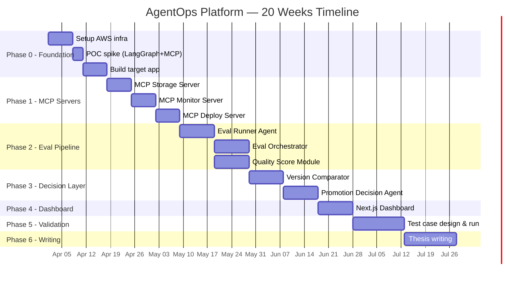
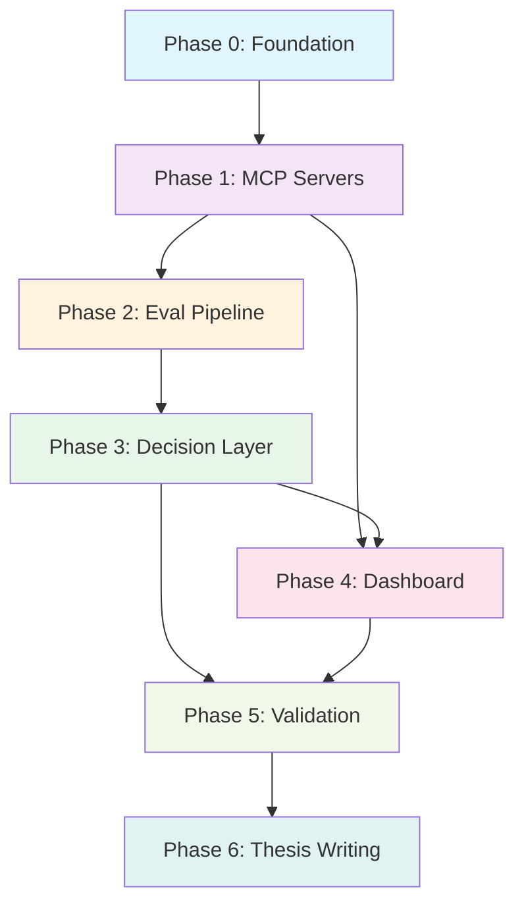

# AgentOps Platform — Implementation Plan & Task Checklist

> **Mục đích:** Tài liệu này mô tả kế hoạch triển khai chi tiết platform AgentOps, chia theo từng phase với checklist task cụ thể để team dev có thể follow và track progress. Mỗi task đều có mô tả rõ ràng input/output, dependencies, và definition of done.

---

## Tổng Quan Flow Triển Khai



---

## Phase 0: Foundation Setup (Tuần 1–2)

**Mục tiêu:** Chuẩn bị hạ tầng AWS và có target app (translation agent) chạy được end-to-end.

### Checklist

- [ ] **P0-1: Tạo AWS Account & cấu hình IAM**
  - Tạo IAM user riêng cho project (không dùng root)
  - Tạo IAM policy cho S3, Lambda, DynamoDB, CloudWatch, EC2
  - Setup AWS CLI local với credentials
  - **Output:** IAM user + policy JSON files lưu trong repo

- [ ] **P0-2: Provision AWS Infrastructure**
  - Tạo S3 bucket: `agentops-storage` (versioning ON)
  - Tạo DynamoDB table: `agentops-versions` (partition key: `version_id`)
  - Tạo DynamoDB table: `agentops-eval-runs` (partition key: `run_id`, sort key: `timestamp`)
  - Launch EC2 **t3.small** instance (Ubuntu 22.04, **2 GB RAM**)
    - ⚠️ Không dùng t3.micro (1GB) — sẽ OOM khi chạy 6 services cùng lúc
    - Chi phí ~$15/tháng (vẫn rất rẻ cho thesis scope)
  - **Gán Elastic IP** cho EC2 instance (miễn phí khi attach vào running instance)
    - Tránh public IP thay đổi khi restart → Lambda webhook không bị fail
  - Setup Security Group: cho phép SSH (port 22) + HTTP (port 80, 7000, 9000, 9001)
  - **Output:** Tất cả resources chạy được, có thể SSH vào EC2, IP cố định

- [ ] **P0-3: Setup EC2 Environment**
  - Install Python 3.11+, pip
  - Tạo **venv riêng cho mỗi service** (bắt buộc, không optional):
    - `venv-target-app/`, `venv-mcp-storage/`, `venv-mcp-monitor/`, `venv-mcp-deploy/`, `venv-orchestrator/`
    - Mỗi venv có `requirements.txt` riêng → tránh dependency conflict
  - Install Node.js 18+ (cho dashboard sau này)
  - Install Docker (recommended — fallback nếu venv quản lý phức tạp)
  - Setup nginx reverse proxy cho MCP servers
  - **Output:** EC2 ready cho deployment, 5 venvs created

- [ ] **P0-4: Setup GitHub Repository**
  - Tạo repo structure:
    ```
    agentops-platform/
    ├── target-app/           # Translation agent
    ├── mcp-servers/
    │   ├── storage/
    │   ├── monitor/
    │   └── deploy/
    ├── agents/
    │   ├── orchestrator/
    │   ├── eval-runner/
    │   ├── comparator/
    │   └── decision/
    ├── dashboard/            # Next.js
    ├── eval-datasets/        # Test cases
    ├── configs/              # Prompt templates, model configs
    ├── scripts/              # Setup, deploy scripts
    └── docs/
    ```
  - Setup GitHub Webhook trỏ đến AWS Lambda endpoint
  - Setup `.env.example` cho tất cả secrets
  - **Output:** Repo structure + webhook active

- [ ] **P0-5: Build Target App — Translation Agent**
  - Dùng lại translation agent từ Maxflow internship
  - Wrap thành REST API (FastAPI):
    - `POST /translate` — nhận text, trả bản dịch
    - `POST /translate/batch` — nhận list texts
    - `GET /health` — health check
  - Config được thay đổi: prompt template, model name, temperature
  - Lưu config dưới dạng JSON file (để version control được)
  - Deploy lên EC2, chạy ổn định
  - **Output:** Translation API chạy trên EC2, response time < 5s

- [ ] **P0-6: Tạo Baseline Test Suite + Seed v_current**
  - Tạo ít nhất 10 test cases cơ bản cho translation agent
  - Format: JSON file `[{"input": "...", "expected_output": "...", "category": "..."}]`
  - Bao gồm các loại: simple sentence, complex paragraph, technical text
  - **Strategy tạo expected output:** dùng GPT-4 tạo draft expected output → manually verify & fix. Nhanh hơn nhiều so với viết từ đầu.
  - Chạy manual 1 lần để có baseline results
  - ⚠️ **First-run problem:** Save kết quả baseline vào DynamoDB làm `v_current`
    - Nếu không có v_current, Comparator sẽ crash khi fetch scores
    - Comparator cần logic: nếu không tìm thấy v_current → skip comparison, auto-promote v_new làm baseline
    - Seed script: `scripts/seed-baseline.py` — upload baseline results vào DynamoDB + S3
  - **Output:** `eval-datasets/baseline_v1.json` + `eval-results/baseline_results.json` + v_current seeded trong DynamoDB

- [ ] **P0-7: POC Spike — Validate Tech Stack** ⚡
  - ⚠️ **Đây là task quan trọng nhất Phase 0** — phát hiện sớm rủi ro kỹ thuật
  - Checklist validate (xem chi tiết tại `docs/poc-spike-checklist.md`):
    1. Build 1 LangGraph agent đơn giản gọi 1 MCP tool (echo tool) qua **SSE transport** → verify end-to-end
    2. Verify `langchain-mcp-adapters` tương thích với LangGraph version đang dùng
    3. Gemini Flash API accessible từ EC2, latency chấp nhận được (< 3s)
    4. GitHub webhook deliver đến Lambda
    5. Lambda gọi được EC2 endpoint (qua Elastic IP)
  - **Timeline:** 2-3 ngày
  - **Nếu LangGraph + MCP không work:** fallback sang REST calls trực tiếp (vẫn giữ MCP server nhưng gọi qua HTTP thay vì MCP client)
  - **Output:** POC report ghi rõ pass/fail từng item, decision cho tech stack

### Definition of Done — Phase 0

✅ EC2 t3.small running, Elastic IP attached, SSH accessible  
✅ S3 + DynamoDB provisioned  
✅ Target app (translation API) chạy trên EC2  
✅ GitHub webhook configured  
✅ Baseline test suite created (≥ 10 cases)  
✅ **POC spike passed** — LangGraph + MCP integration verified  
✅ 5 venvs created cho 5 Python services

---

## Phase 1: MCP Servers (Tuần 3–5)

**Mục tiêu:** Build 3 MCP servers đóng vai trò abstraction layer giữa orchestration agent và AWS infrastructure.

> **Quan trọng:** Mỗi MCP server là một FastAPI app, expose tools theo MCP protocol chuẩn sử dụng **SSE (Server-Sent Events) transport** — server chạy HTTP endpoint, agent kết nối qua MCP client over HTTP. Chọn SSE vì `langchain-mcp-adapters` hỗ trợ tốt và cho phép tách deployment sau này. Agent discover và gọi tools thông qua MCP client, không phải REST call thông thường.

### Checklist

#### MCP Server: Storage (Tuần 3)

- [ ] **P1-1: Setup MCP Server boilerplate**
  - Chọn MCP SDK: dùng `mcp` Python SDK (official từ Anthropic)
  - Setup project structure cho `mcp-servers/storage/`
  - Config kết nối đến S3 + DynamoDB
  - **Output:** Server khởi động được, MCP handshake OK

- [ ] **P1-2: Implement Storage tools**
  - Tool `save_prompt_version`: upload prompt template lên S3, tạo record trong DynamoDB
    - Input: `prompt_content`, `version_label`, `metadata` (model, temperature, etc.)
    - Output: `version_id`, `s3_path`, `timestamp`
  - Tool `get_prompt_version`: lấy prompt template theo version_id
    - Input: `version_id`
    - Output: `prompt_content`, `metadata`, `created_at`
  - Tool `list_versions`: liệt kê tất cả versions, sort theo thời gian
    - Input: `limit` (optional, default 20)
    - Output: list of `{version_id, label, created_at, status}`
  - Tool `save_eval_result`: lưu kết quả evaluation
    - Input: `run_id`, `version_id`, `scores`, `details`
    - Output: `result_id`, `timestamp`
  - Tool `get_eval_results`: lấy eval results theo version_id hoặc run_id
    - Input: `version_id` hoặc `run_id`
    - Output: list of eval result records
  - **Output:** 5 tools hoạt động đúng

- [ ] **P1-3: Viết tests cho Storage Server**
  - Unit tests cho mỗi tool (mock AWS)
  - Integration test: save → get → verify data integrity
  - **Output:** ≥ 10 test cases, all passing

#### MCP Server: Monitor (Tuần 4)

- [ ] **P1-4: Implement Monitor tools**
  - Tool `push_metric`: ghi custom metric vào CloudWatch
    - Input: `metric_name`, `value`, `dimensions` (version_id, environment)
    - Output: `status`, `timestamp`
  - Tool `get_metrics`: đọc metric history từ CloudWatch
    - Input: `metric_name`, `version_id`, `time_range` (e.g., "last_24h")
    - Output: list of `{timestamp, value}`
  - Tool `get_logs`: đọc logs từ CloudWatch Logs
    - Input: `log_group`, `filter_pattern`, `time_range`
    - Output: list of log entries
  - Tool `check_health`: kiểm tra health status của target app
    - Input: `endpoint_url`
    - Output: `status`, `response_time_ms`, `timestamp`
  - **Output:** 4 tools hoạt động đúng

- [ ] **P1-5: Viết tests cho Monitor Server**
  - Unit tests (mock CloudWatch)
  - Integration test: push metric → get metric → verify
  - **Output:** ≥ 8 test cases, all passing

#### MCP Server: Deploy (Tuần 5)

- [ ] **P1-6: Implement Deploy tools**
  - **Staging vs Production model:**
    - **Staging** = target app chạy port **9001**, nhận config mới để eval (chưa serve traffic thật)
    - **Production** = target app chạy port **9000**, config đang active, serve traffic thật
    - Deploy flow: deploy to staging → eval → nếu pass → swap staging config sang production
  - Tool `deploy_version`: deploy một version cụ thể lên target environment
    - Input: `version_id`, `environment` (`staging` | `production`)
    - Output: `deployment_id`, `status`, `endpoint_url`
    - Flow: pull config từ S3 → restart target app trên port tương ứng → verify health
  - Tool `rollback_version`: rollback về version trước
    - Input: `target_version_id`
    - Output: `deployment_id`, `status`
  - Tool `get_deployment_status`: kiểm tra trạng thái deployment hiện tại
    - Input: `deployment_id` hoặc `environment`
    - Output: `current_version_id`, `status`, `uptime`, `last_deployed_at`
  - **Output:** 3 tools hoạt động đúng

- [ ] **P1-7: Viết tests cho Deploy Server**
  - Unit tests (mock deployment process)
  - Integration test: deploy → check status → rollback → verify
  - **Output:** ≥ 6 test cases, all passing

- [ ] **P1-8: Viết MCP Server Integration Doc**
  - Document cách discover tools, cách gọi từ MCP client
  - Sample MCP client code snippet
  - Troubleshooting guide
  - **Output:** `docs/mcp-integration-guide.md`

### Definition of Done — Phase 1

✅ 3 MCP servers chạy trên EC2 (ports 8000, 8001, 8002)  
✅ Tổng 12 tools hoạt động & tested  
✅ MCP client có thể discover và gọi tất cả tools  
✅ Integration doc hoàn chỉnh

---

## Phase 2: Eval Pipeline (Tuần 6–9)

**Mục tiêu:** Build hệ thống evaluation tự động dùng LangGraph, bao gồm Eval Runner Agent và Quality Score module.

### Checklist

#### Eval Runner Agent (Tuần 6–7)

- [ ] **P2-1: Setup LangGraph project**
  - Install LangGraph, LangChain, LangSmith
  - Cấu hình LangSmith tracing (bắt buộc từ đầu để debug)
  - Setup Gemini Flash API credentials
  - **Output:** LangGraph hello-world agent chạy được

- [ ] **P2-2: Design Eval Runner State Graph**
  - Các state nodes:
    1. `load_test_suite` — đọc test cases từ MCP Storage
    2. `run_test_case` — gửi input đến target app, nhận output
    3. `evaluate_output` — dùng Gemini Flash (LLM-as-judge) để chấm điểm
    4. `aggregate_results` — tính điểm tổng hợp
    5. `save_results` — lưu kết quả qua MCP Storage
  - Vẽ state graph diagram
  - **Output:** State graph design doc + diagram

- [ ] **P2-3: Implement Eval Runner Agent**
  - Implement từng node theo design ở P2-2
  - Eval Runner gọi target app qua HTTP, gọi MCP tools qua MCP client
  - Xử lý edge cases: target app timeout, LLM API error, partial failures
  - Retry logic: max 3 retries per test case
  - **Output:** Agent chạy được end-to-end với baseline test suite

- [ ] **P2-4: Implement LLM-as-Judge Evaluator**
  - Tạo eval prompt template cho Gemini Flash:
    - Input: `question`, `expected_answer`, `actual_answer`
    - Output: structured JSON `{"score": 0-10, "reasoning": "...", "issues": [...]}`
  - Thử 2-3 prompt variants, chọn variant cho kết quả consistent nhất
  - Log mọi LLM judge call để audit sau
  - **Output:** Evaluator module stable, consistent output format

#### Quality Score Module (Tuần 8)

- [ ] **P2-5: Define Quality Score dimensions**
  - Xem chi tiết đầy đủ tại `configs/quality_score_spec.md`
  - Xác định 4 chiều đánh giá (đã loại bỏ Tool-Call Accuracy vì translation agent không có tool calls):
    1. **Task Completion Rate** (weight: 0.35) — % test cases pass threshold
    2. **Output Quality** (weight: 0.35) — average LLM-as-judge score (0-10)
    3. **Latency** (weight: 0.20) — average response time (lower is better, normalize 0-10)
    4. **Cost Efficiency** (weight: 0.10) — cost per request (lower is better, normalize 0-10)
  - Công thức: `QualityScore = Σ(weight_i × score_i)` → giá trị 0-10
  - **Output:** Quality Score specification doc (`configs/quality_score_spec.md`)

- [ ] **P2-6: Implement Quality Score Calculator**
  - Module nhận raw eval results, output single Quality Score
  - Hỗ trợ configurable weights (load từ config file)
  - Output format:
    ```json
    {
      "quality_score": 8.1,
      "breakdown": {
        "task_completion": { "score": 8.5, "weight": 0.35 },
        "output_quality": { "score": 7.2, "weight": 0.35 },
        "latency": { "score": 7.5, "weight": 0.2 },
        "cost_efficiency": { "score": 9.7, "weight": 0.1 }
      },
      "metadata": { "version_id": "...", "run_id": "...", "timestamp": "..." }
    }
    ```
  - **Output:** Calculator module + unit tests

#### Eval Orchestrator (Tuần 9)

- [ ] **P2-7: Implement Eval Orchestrator Agent**
  - Orchestrator là LangGraph agent "cha" điều phối toàn bộ eval flow
  - State graph:
    1. `receive_trigger` — nhận trigger từ GitHub webhook (qua Lambda)
    2. `parse_change` — xác định loại thay đổi (prompt/code/config)
    3. `prepare_eval` — chọn test suite phù hợp, config eval parameters
    4. `run_eval` — gọi Eval Runner Agent
    5. `compute_score` — gọi Quality Score Calculator
    6. `route_result` — chuyển kết quả đến Decision Layer (Phase 3)
  - **Output:** Orchestrator agent chạy end-to-end khi trigger

- [ ] **P2-8: Implement Lambda Trigger + Concurrent Locking**
  - Lambda function nhận GitHub webhook payload (qua Lambda Function URL, không cần API Gateway)
  - Parse payload: xác định files changed, commit message, branch
  - Filter: chỉ trigger khi thay đổi trong `configs/` hoặc `target-app/`
  - ⚠️ **Concurrent pipeline locking:**
    - Trước khi trigger, check DynamoDB `agentops-eval-runs` xem có record nào `status = "running"` không
    - Nếu có pipeline đang chạy → log "skipped: pipeline already running" và return
    - Tránh race condition: 2 push liên tiếp → 2 pipeline chạy song song → overwrite lẫn nhau
  - Gửi trigger message đến Orchestrator (qua HTTP đến Elastic IP)
  - **Output:** Push change → eval tự động chạy, concurrent pushes handled safely

### Definition of Done — Phase 2

✅ Eval Runner Agent chạy được evaluation trên ≥ 10 test cases  
✅ Quality Score calculated thành công cho mỗi eval run  
✅ Orchestrator trigger được từ GitHub push  
✅ LangSmith traces visible cho toàn bộ flow  
✅ Average eval run time < 5 minutes

---

## Phase 3: Decision Layer (Tuần 10–12)

**Mục tiêu:** Build các agent ra quyết định tự động: so sánh versions và promote/rollback.

### Checklist

#### Version Comparator Agent (Tuần 10–11)

- [ ] **P3-1: Implement Version Comparator Agent**
  - So sánh Quality Score của `v_new` vs `v_current`
  - State graph:
    1. `fetch_scores` — lấy scores của cả 2 versions từ MCP Storage
    2. `compare_dimensions` — so sánh từng dimension
    3. `detect_regression` — phát hiện regression (score giảm > threshold)
    4. `generate_report` — tạo comparison report
  - Output format:
    ```json
    {
      "verdict": "regression_detected | improved | no_change",
      "v_new_score": 7.2,
      "v_current_score": 8.1,
      "delta": -0.9,
      "regressions": [
        { "dimension": "output_quality", "old": 8.0, "new": 6.5, "delta": -1.5 }
      ],
      "improvements": [
        { "dimension": "latency", "old": 5.0, "new": 7.0, "delta": +2.0 }
      ]
    }
    ```
  - **Output:** Comparator agent running + tested

- [ ] **P3-2: Define Regression Thresholds**
  - Configurable thresholds (load từ `configs/thresholds.json`):
    - `overall_regression_threshold`: -0.5 (score giảm > 0.5 → regression)
    - `critical_dimension_threshold`: -1.0 (bất kỳ dimension nào giảm > 1.0 → critical)
    - `auto_promote_threshold`: +0.3 (score tăng > 0.3 → có thể auto promote)
  - **Output:** Threshold config file + documentation

#### Promotion Decision Agent (Tuần 11–12)

- [ ] **P3-3: Implement Promotion Decision Agent**
  - Nhận comparison report từ Comparator, ra decision
  - Decision logic:
    ```
    if v_new.score >= v_current.score + auto_promote_threshold:
        → AUTO PROMOTE (deploy v_new)
    elif v_new.score >= v_current.score - overall_regression_threshold:
        → NO ACTION (keep v_current, nhưng v_new available)
    elif any_dimension_regression > critical_dimension_threshold:
        → ROLLBACK + ALERT (critical regression)
    else:
        → ESCALATE TO HUMAN (borderline case, cần human review)
    ```
  - Sau khi quyết định: gọi MCP Deploy tool tương ứng
  - Log mọi decision với reasoning đến MCP Monitor
  - **Output:** Decision agent running + tested

- [ ] **P3-4: Implement Notification System**
  - Khi decision = ESCALATE hoặc ROLLBACK:
    - Gửi notification (chọn 1: Slack webhook / email / Discord)
    - Notification content: comparison report summary + recommended action
  - Khi decision = AUTO PROMOTE:
    - Log thành công, update deployment status
  - **Output:** Notification system working

- [ ] **P3-5: End-to-End Integration Test**
  - Test full flow: push change → trigger → eval → compare → decision → deploy/rollback
  - Test case scenarios:
    1. Push improvement → auto promote
    2. Push regression → rollback + alert
    3. Push minor change → no action
    4. Push borderline change → escalate
  - **Output:** 4 E2E test scenarios passing

### Definition of Done — Phase 3

✅ Version Comparator generates accurate comparison reports  
✅ Decision Agent makes correct decisions cho 4 scenarios  
✅ Full pipeline: push → eval → decision → action chạy < 10 phút  
✅ Notification works khi escalate/rollback  
✅ All decisions logged with reasoning

---

## Phase 4: Dashboard (Tuần 13–14)

**Mục tiêu:** Build Next.js dashboard để visualize metric drift, version history, và pipeline runs.

### Checklist

- [x] **P4-1: Setup Next.js Project**
  - Init Next.js (App Router) + TypeScript
  - Install dependencies: Recharts (charts), TanStack Table (data tables)
  - Setup API routes proxy đến MCP servers
  - **Output:** Next.js dev server running

- [x] **P4-2: Build Dashboard Pages**
  - **Page 1 — Overview:** Hiển thị current version, Quality Score hiện tại, recent pipeline runs
  - **Page 2 — Version History:** Timeline tất cả versions, mỗi version hiện score + status (promoted/rolled back/pending)
  - **Page 3 — Metric Drift:** Line charts hiện Quality Score theo thời gian, drill-down theo từng dimension
  - **Page 4 — Pipeline Runs:** Table liệt kê mọi eval runs, click vào xem detail (scores, comparison, decision)
  - **Page 5 — Comparison View:** So sánh 2 versions side-by-side (scores, outputs on cùng test cases)
  - **Output:** 5 pages functional

- [x] **P4-3: Connect Dashboard đến Data**
  - API routes gọi DynamoDB (đọc versions, eval runs, decisions)
  - API routes gọi CloudWatch (đọc metrics)
  - Real-time hoặc polling (mỗi 30s refresh)
  - **Output:** Dashboard hiển thị real data

- [x] **P4-4: Deploy Dashboard**
  - Deploy lên EC2 (cùng instance, dùng nginx serve)
  - Hoặc deploy lên Vercel (miễn phí)
  - **Output:** Dashboard accessible via URL

### Definition of Done — Phase 4

✅ Dashboard accessible, hiển thị real data  
✅ Quality Score drift chart hoạt động  
✅ Version comparison view functional  
✅ Pipeline run history viewable

---

## Phase 5: Validation & Measurement (Tuần 15–17)

**Mục tiêu:** Validate platform bằng case study thực tế, đo lường improvement so với manual process.

### Checklist

- [ ] **P5-1: Thiết kế 50+ Test Cases**
  - Phân bổ theo category:
    - 15 cases: Simple sentences
    - 15 cases: Complex paragraphs
    - 10 cases: Technical/domain-specific text
    - 10 cases: Edge cases (empty input, very long text, special characters)
  - **Strategy tạo expected output:**
    1. Dùng GPT-4 để tạo draft expected translations cho toàn bộ 50 cases
    2. Manually review & fix từng draft (estimate: 2–3 ngày cho 50 cases)
    3. Có ít nhất 1 người verify thêm cho 10 cases phức tạp nhất
  - ⚠️ Effort estimate: **3-5 ngày** cho toàn bộ process (đã account trong timeline Phase 5: 3 tuần)
  - **Output:** `eval-datasets/validation_suite_v1.json`

- [ ] **P5-2: Thiết kế Experiment Scenarios**
  - Scenario 1: Thay đổi prompt template (giữ model cố định)
  - Scenario 2: Swap model (Gemini Flash → GPT-4 mini, giữ prompt cố định)
  - Scenario 3: Thay đổi temperature/system prompt
  - Scenario 4: Introduce intentional regression (bad prompt)
  - Scenario 5: Incremental improvement (prompt tuning dần)
  - **Output:** 5 scenarios defined + documented

- [ ] **P5-3: Chạy Experiments**
  - Chạy mỗi scenario thông qua pipeline
  - Đo: Time-to-detect-regression, Rollback latency, False positive rate, False negative rate
  - Song song: chạy cùng scenarios bằng manual process để có baseline comparison
  - **Output:** Raw experimental data

- [ ] **P5-4: Phân tích Kết quả**
  - So sánh Automated vs Manual:
    - Time-to-detect: automated nhanh hơn bao nhiêu lần?
    - Rollback latency: automated nhanh hơn bao nhiêu?
    - Accuracy: automated bỏ sót bao nhiêu regression? (false negatives)
  - Correlation analysis: Quality Score vs Human judgement
  - Ablation study: thử bỏ từng dimension, xem impact
  - **Output:** Analysis report with charts + tables

- [ ] **P5-5: Viết Validation Report**
  - Tổng hợp kết quả, format cho thesis
  - Include: experimental setup, results tables, charts, statistical significance
  - **Output:** `docs/validation_report.md`

### Definition of Done — Phase 5

✅ 50+ test cases designed and validated  
✅ 5 experiment scenarios executed  
✅ Quantitative comparison: automated vs manual  
✅ Correlation analysis: Quality Score vs Human  
✅ Validation report hoàn chỉnh

---

## Phase 6: Thesis Writing (Tuần 18–20)

**Mục tiêu:** Viết báo cáo đồ án tốt nghiệp hoàn chỉnh.

### Checklist

- [ ] **P6-1: Viết Chapter 1 — Introduction & Problem Statement**
- [ ] **P6-2: Viết Chapter 2 — Related Work & Background**
  - LLMOps landscape, existing tools (MLflow, DVC, RAGAS, DeepEval)
  - MCP protocol overview
  - LangGraph architecture
- [ ] **P6-3: Viết Chapter 3 — System Design & Architecture**
  - Lấy từ system design doc, polish cho academic format
- [ ] **P6-4: Viết Chapter 4 — Implementation Details**
  - Mô tả implementation từng component
  - Key algorithms, design decisions
- [ ] **P6-5: Viết Chapter 5 — Evaluation & Results**
  - Lấy từ validation report
- [ ] **P6-6: Viết Chapter 6 — Conclusion & Future Work**
- [ ] **P6-7: Chuẩn bị Slide bảo vệ**
  - 15-20 slides
  - Focus: problem → architecture → demo → results

### Definition of Done — Phase 6

✅ Báo cáo hoàn chỉnh (≥ 60 trang)  
✅ Slide bảo vệ ready  
✅ Demo deployable

---

## Cross-Cutting Concerns (Áp dụng toàn bộ phases)

### Code Quality

- [ ] Mỗi module có README riêng giải thích cách chạy
- [ ] Type hints cho toàn bộ Python code
- [ ] Logging thống nhất (structured JSON logs)
- [ ] Error handling có strategy rõ ràng (retry vs fail-fast)

### Documentation

- [ ] API docs cho mỗi MCP server (tools list, input/output schema)
- [ ] Architecture diagrams cập nhật khi có thay đổi
- [ ] Decision log: ghi lại lý do cho mỗi technical decision quan trọng

### DevOps

- [ ] `.env.example` luôn cập nhật
- [ ] Scripts: `scripts/setup.sh`, `scripts/deploy.sh`, `scripts/run-eval.sh`
- [ ] CI basics: lint check trên mỗi PR (optional nhưng recommended)

---

## Dependencies Map



> **Lưu ý:** Phase 4 (Dashboard) có thể bắt đầu song song với Phase 3 vì dashboard chỉ cần data từ MCP Storage (đã có từ Phase 1). Tuy nhiên, dashboard sẽ chỉ hoàn chỉnh khi có data từ decision layer.
