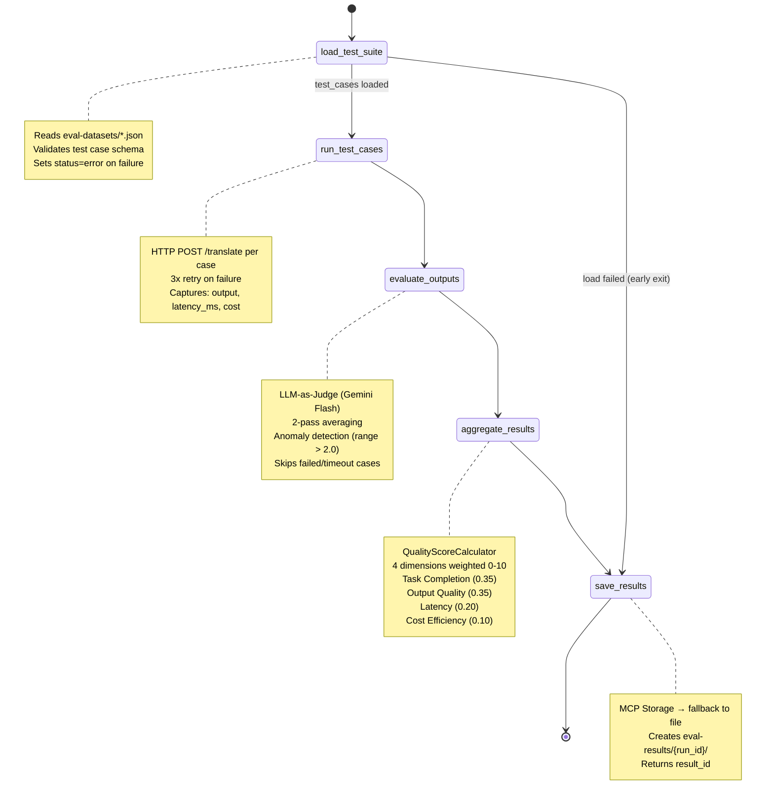
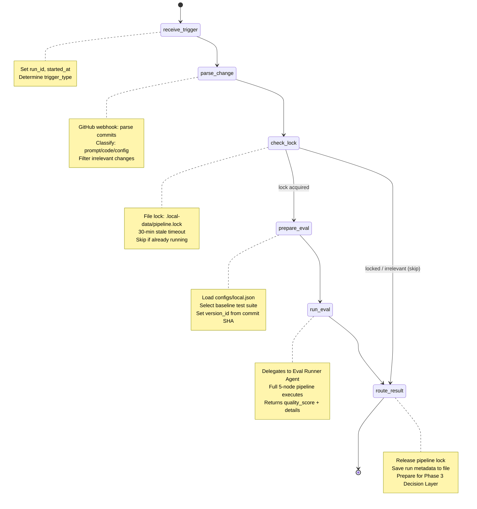
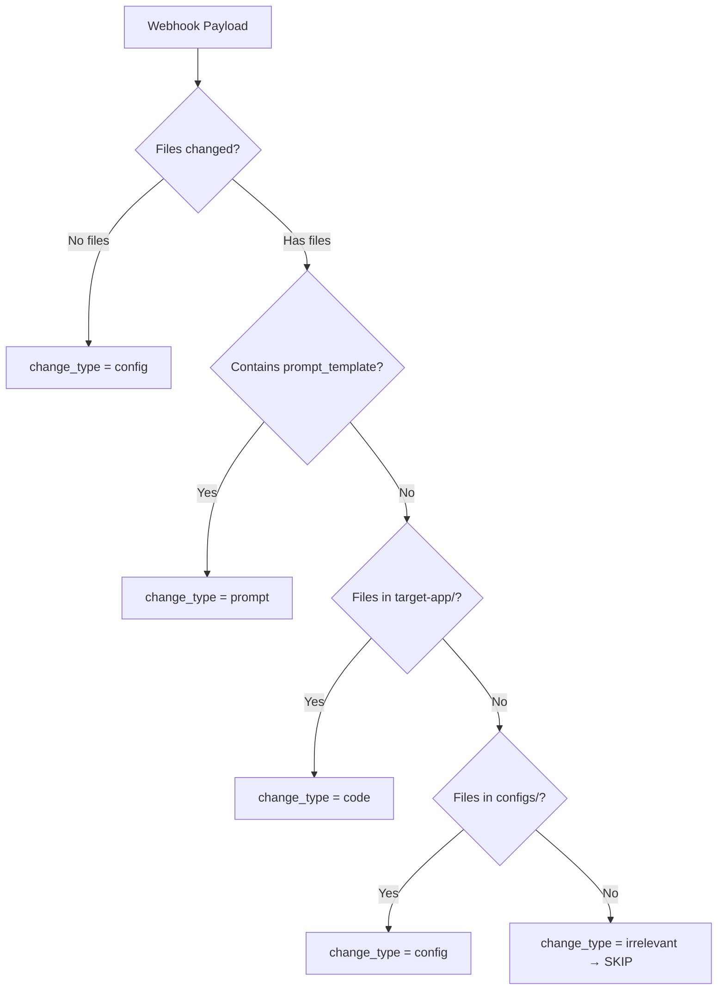
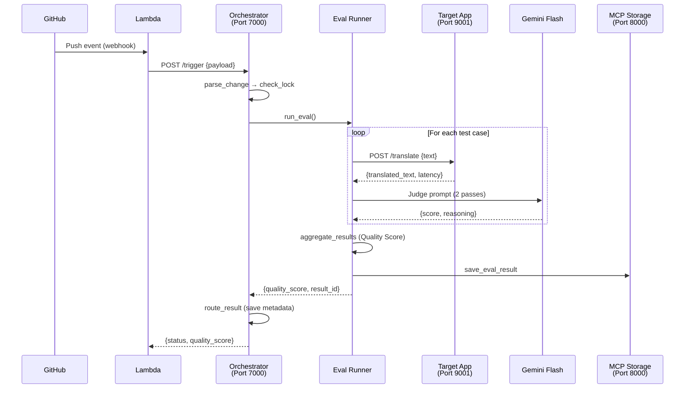

# State Graph Design — Phase 2 Agents

> **Output of P2-2** — Design doc describing the LangGraph state graphs for Eval Runner and Orchestrator agents.

---

## 1. Eval Runner Agent State Graph

### 1.1 Overview

The Eval Runner Agent is a **linear pipeline** with one conditional edge (early exit on load failure). It evaluates a target application's translation quality using an LLM-as-judge approach.

### 1.2 State Schema (`EvalRunnerState`)

| Field             | Type         | Set By  | Description                                           |
| ----------------- | ------------ | ------- | ----------------------------------------------------- |
| `run_id`          | `str`        | Input   | Unique identifier for this eval run                   |
| `version_id`      | `str`        | Input   | Version of the target app being evaluated             |
| `test_suite_path` | `str`        | Input   | Path to test suite JSON file                          |
| `target_app_url`  | `str`        | Input   | URL of the target app (e.g., `http://localhost:9001`) |
| `test_cases`      | `list[dict]` | Node 1  | Loaded test cases from JSON                           |
| `test_results`    | `list[dict]` | Node 2  | Raw results from target app (output, latency, cost)   |
| `judge_results`   | `list[dict]` | Node 3  | LLM-as-judge scores per test case                     |
| `quality_score`   | `dict`       | Node 4  | Composite quality score with breakdown                |
| `result_id`       | `str`        | Node 5  | ID of the saved result record                         |
| `status`          | `str`        | Various | Pipeline status: `running`, `completed`, `error`      |
| `errors`          | `list[str]`  | Various | Accumulated warnings/errors                           |

### 1.3 Node Descriptions

| #   | Node                | Purpose                                   | Key Logic                                                                    |
| --- | ------------------- | ----------------------------------------- | ---------------------------------------------------------------------------- |
| 1   | `load_test_suite`   | Read test cases from JSON or MCP Storage  | File read → parse JSON → validate. On failure → early exit to `save_results` |
| 2   | `run_test_cases`    | Execute each test case against target app | HTTP POST `/translate` per case, 3 retries, capture latency/cost/output      |
| 3   | `evaluate_outputs`  | Score each output using LLM-as-judge      | Gemini Flash 2-pass averaging, anomaly detection, skip failed cases          |
| 4   | `aggregate_results` | Compute composite Quality Score           | 4-dimension weighted score via `QualityScoreCalculator`                      |
| 5   | `save_results`      | Persist results to storage                | Try MCP Storage → fallback to direct file write                              |

### 1.4 Diagram



### 1.5 Edge Cases Handled

| Scenario                             | Behavior                                                    |
| ------------------------------------ | ----------------------------------------------------------- |
| Test suite file not found            | Early exit → `save_results` with `status=error`             |
| Target app timeout (30s)             | Mark test case `status=timeout`, `score=0`, continue        |
| Target app HTTP error                | Retry up to 3 times, then mark `status=failed`              |
| LLM judge API error                  | Retry up to 3 times per pass, skip on exhaustion            |
| Judge anomaly (score variance > 2.0) | Flag `anomaly=true`, use averaged score                     |
| Partial failures                     | Continue with remaining test cases, aggregate what succeeds |
| MCP Storage unavailable              | Fallback to direct `.local-data/` file write                |

---

## 2. Eval Orchestrator Agent State Graph

### 2.1 Overview

The Orchestrator is the **"parent" agent** that coordinates the full eval pipeline. It receives triggers (GitHub webhook via Lambda, or manual), prevents concurrent runs, and delegates to the Eval Runner.

### 2.2 State Schema (`OrchestratorState`)

| Field             | Type        | Set By       | Description                                                   |
| ----------------- | ----------- | ------------ | ------------------------------------------------------------- |
| `run_id`          | `str`       | Input/Node 1 | Pipeline run identifier                                       |
| `trigger_type`    | `str`       | Input        | `"webhook"` or `"manual"`                                     |
| `webhook_payload` | `dict`      | Input        | Raw GitHub webhook payload                                    |
| `change_type`     | `str`       | Node 2       | `"prompt"`, `"code"`, `"config"`, `"irrelevant"`, `"unknown"` |
| `changed_files`   | `list[str]` | Node 2       | Files changed in the push                                     |
| `commit_sha`      | `str`       | Node 2       | Short commit SHA                                              |
| `branch`          | `str`       | Node 2       | Branch name                                                   |
| `lock_acquired`   | `bool`      | Node 3       | Whether pipeline lock was acquired                            |
| `version_id`      | `str`       | Node 4       | Version ID for this eval (commit SHA or UUID)                 |
| `test_suite_path` | `str`       | Node 4       | Selected test suite path                                      |
| `target_app_url`  | `str`       | Node 4       | Target app URL from config                                    |
| `eval_result`     | `dict`      | Node 5       | Full eval result from Eval Runner                             |
| `quality_score`   | `float`     | Node 5       | Composite quality score                                       |
| `status`          | `str`       | Various      | `"running"`, `"completed"`, `"skipped"`, `"error"`            |
| `started_at`      | `str`       | Node 1       | ISO timestamp                                                 |
| `completed_at`    | `str`       | Node 6       | ISO timestamp                                                 |
| `errors`          | `list[str]` | Various      | Accumulated errors                                            |

### 2.3 Node Descriptions

| #   | Node              | Purpose                            | Key Logic                                                            |
| --- | ----------------- | ---------------------------------- | -------------------------------------------------------------------- |
| 1   | `receive_trigger` | Initialize pipeline run            | Set `run_id`, `started_at`, `status=running`                         |
| 2   | `parse_change`    | Determine change type from webhook | Parse GitHub payload, classify files → prompt/code/config/irrelevant |
| 3   | `check_lock`      | Prevent concurrent pipeline runs   | File-based lock (30-min stale timeout), skip if locked               |
| 4   | `prepare_eval`    | Configure eval parameters          | Select test suite, load target URL from config, set version_id       |
| 5   | `run_eval`        | Invoke Eval Runner Agent           | Call `run_eval()` from eval_runner, capture quality_score            |
| 6   | `route_result`    | Finalize and persist run metadata  | Release lock, save to `pipeline-runs/{run_id}.json`, set status      |

### 2.4 Diagram



### 2.5 Change Type Classification



### 2.6 Concurrent Locking Strategy

| Aspect                    | Value                                                         |
| ------------------------- | ------------------------------------------------------------- |
| Lock mechanism            | File: `.local-data/pipeline.lock`                             |
| Stale timeout             | 30 minutes                                                    |
| Production equivalent     | DynamoDB conditional write on `agentops-eval-runs`            |
| Race condition mitigation | Single-writer model (one EC2 instance)                        |
| Lock content              | `{"run_id": "...", "started_at": "...", "status": "running"}` |

---

## 3. End-to-End Flow



---

## 4. LangSmith Tracing

Both agents pass tracing configuration to `graph.invoke()`:

```python
from agents.tracing import configure_tracing, get_graph_config

configure_tracing()

config = get_graph_config(
    run_name=f"eval-runner-{run_id[:8]}",
    tags=["eval-runner", f"version-{version_id}"],
    metadata={"run_id": run_id, "version_id": version_id},
)

result = graph.invoke(initial_state, config=config)
```

Traces are visible at [smith.langchain.com](https://smith.langchain.com) under the `agentops` project, showing:

- Each node's input/output state
- Execution time per node
- LLM calls within the judge evaluator
- Error traces for debugging
