# AgentOps Platform — System Architecture Design

> **Mục đích:** Tài liệu thiết kế kiến trúc chi tiết cho platform AgentOps. Dành cho team dev đọc để hiểu cách các component kết nối, data flows giữa chúng, API contracts, và infrastructure layout. Không có code — chỉ tập trung vào kiến trúc và thiết kế.

---

## 1. Architecture Overview

### 1.1 High-Level System Diagram

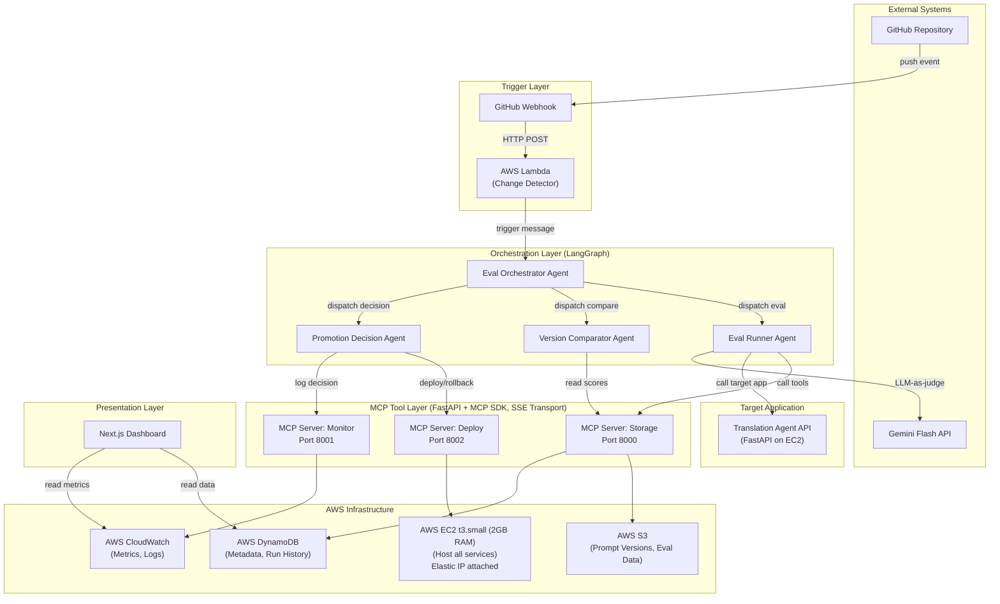

### 1.2 Design Principles

| Principle                       | Áp dụng                                                                                         |
| ------------------------------- | ----------------------------------------------------------------------------------------------- |
| **Separation of Concerns**      | Mỗi agent có 1 trách nhiệm duy nhất. MCP servers tách biệt infrastructure khỏi business logic.  |
| **Loose Coupling via MCP**      | Agent không gọi AWS trực tiếp. Mọi tương tác infra đều qua MCP tools → dễ swap implementation.  |
| **Observability First**         | LangSmith tracing cho agent flows. CloudWatch cho infra metrics. Decision logs cho audit trail. |
| **Fail Safe**                   | Mọi failure mặc định giữ nguyên version hiện tại. Không bao giờ auto-deploy khi có error.       |
| **Configurable, Not Hardcoded** | Thresholds, weights, model names, endpoints đều nằm trong config files.                         |

---

## 2. Layer-by-Layer Design

### 2.1 Trigger Layer

**Vai trò:** Phát hiện thay đổi trong repo và khởi tạo eval pipeline.

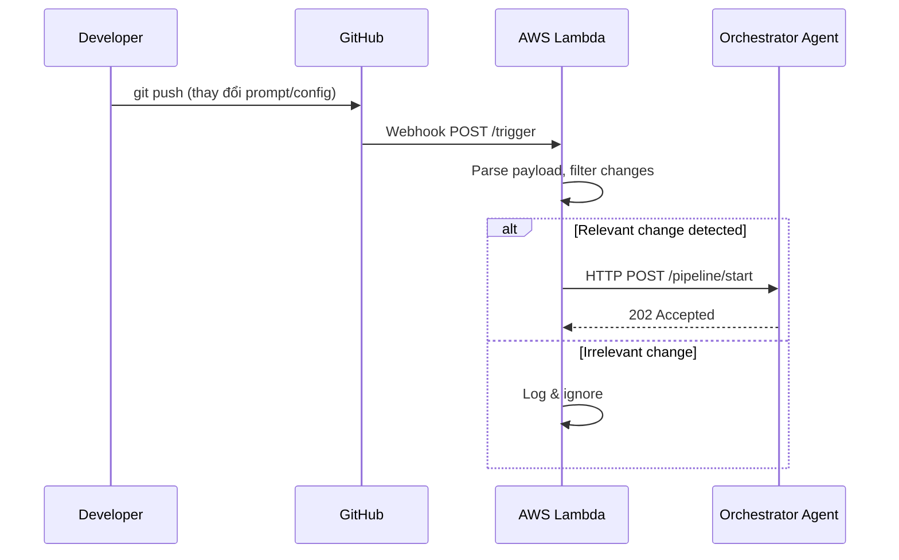

**Lambda Change Detector — Specifications:**

| Field   | Detail                                                                                                    |
| ------- | --------------------------------------------------------------------------------------------------------- |
| Runtime | Python 3.11                                                                                               |
| Trigger | GitHub webhook (push event)                                                                               |
| Memory  | 128 MB                                                                                                    |
| Timeout | 30 seconds                                                                                                |
| Input   | GitHub webhook payload (JSON)                                                                             |
| Logic   | Parse `commits[].modified[]`, check if any file matches `configs/**`, `target-app/**`, `eval-datasets/**` |
| Output  | HTTP POST to Orchestrator with change summary                                                             |

**Change Summary Format (Lambda → Orchestrator):**

```json
{
  "trigger_id": "uuid-v4",
  "repo": "agentops-platform",
  "branch": "main",
  "commit_sha": "abc123",
  "changed_files": [
    "configs/prompt_template_v2.json",
    "configs/model_config.json"
  ],
  "change_type": "prompt_change | config_change | code_change",
  "timestamp": "2025-07-01T10:30:00Z",
  "author": "thuyet"
}
```

---

### 2.2 Orchestration Layer (LangGraph Agents)

**Vai trò:** Điều phối toàn bộ eval pipeline thông qua multi-agent system dựa trên LangGraph.

#### 2.2.1 Agent Communication Pattern

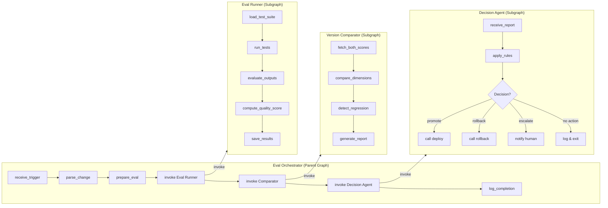

#### 2.2.2 Orchestrator Agent — State Schema

```
OrchestratorState:
  trigger_id: str              # ID trigger từ Lambda
  change_summary: dict         # Parsed change info
  eval_config: dict            # Test suite ID, weights, thresholds
  eval_result: dict | None     # Output từ Eval Runner
  comparison_report: dict | None  # Output từ Comparator
  decision: dict | None        # Output từ Decision Agent
  status: enum                 # PENDING | RUNNING | COMPLETED | FAILED
  error: str | None            # Error message nếu có
  started_at: datetime
  completed_at: datetime | None
```

#### 2.2.3 Eval Runner Agent — Detail

**Vai trò:** Chạy test suite lên target app và chấm điểm bằng LLM-as-judge.

**Flow chi tiết:**

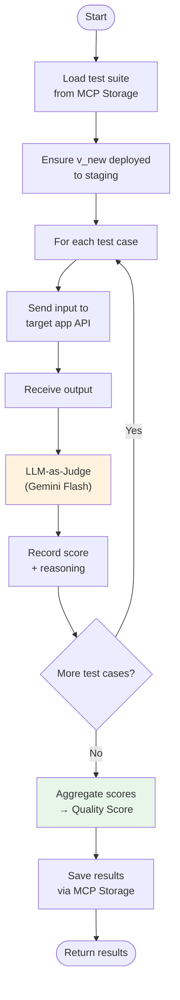

**LLM-as-Judge Prompt Template:**

```
You are an expert evaluator for translation quality.

## Task
Evaluate the translation output based on the following criteria:
- Accuracy: Does the translation preserve the meaning?
- Fluency: Is the translation natural and grammatically correct?
- Completeness: Is all information from the source included?

## Input
Source text: {source_text}
Expected translation: {expected_output}
Actual translation: {actual_output}

## Output Format (strict JSON)
{
  "score": <0-10>,
  "accuracy": <0-10>,
  "fluency": <0-10>,
  "completeness": <0-10>,
  "reasoning": "<brief explanation>",
  "issues": ["<issue 1>", "<issue 2>"]
}
```

#### 2.2.4 Quality Score — Computation Model

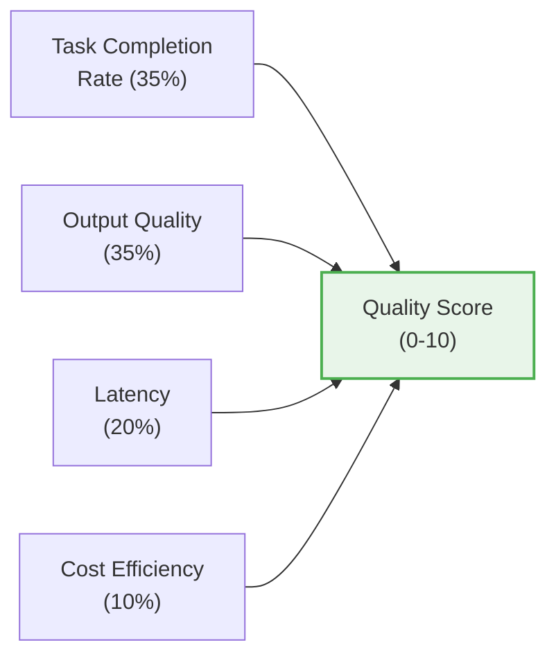

> **Lưu ý:** Đã loại bỏ dimension "Tool-Call Accuracy" vì translation agent là text-in → text-out thuần túy, không có tool calls. Weights được redistribute cho các dimensions còn lại. Xem chi tiết tại `configs/quality_score_spec.md`.

**Normalization Rules:**

| Dimension       | Raw Value                | Normalization             | Score Range |
| --------------- | ------------------------ | ------------------------- | ----------- |
| Task Completion | 0-100%                   | `raw / 10`                | 0-10        |
| Output Quality  | 0-10 (LLM judge avg)     | Direct use                | 0-10        |
| Latency         | ms (lower better)        | `10 - min(raw/1000, 10)`  | 0-10        |
| Cost Efficiency | $/request (lower better) | `10 - min(raw × 100, 10)` | 0-10        |

**Ví dụ tính toán:**

```
Task Completion: 85% → 8.5 × 0.35 = 2.975
Output Quality:  7.2  → 7.2 × 0.35 = 2.520
Latency:      2500ms → 7.5 × 0.20 = 1.500
Cost:       $0.003   → 9.7 × 0.10 = 0.970
                                     ──────
                        Quality Score = 7.965
```

#### 2.2.5 Version Comparator — Decision Logic

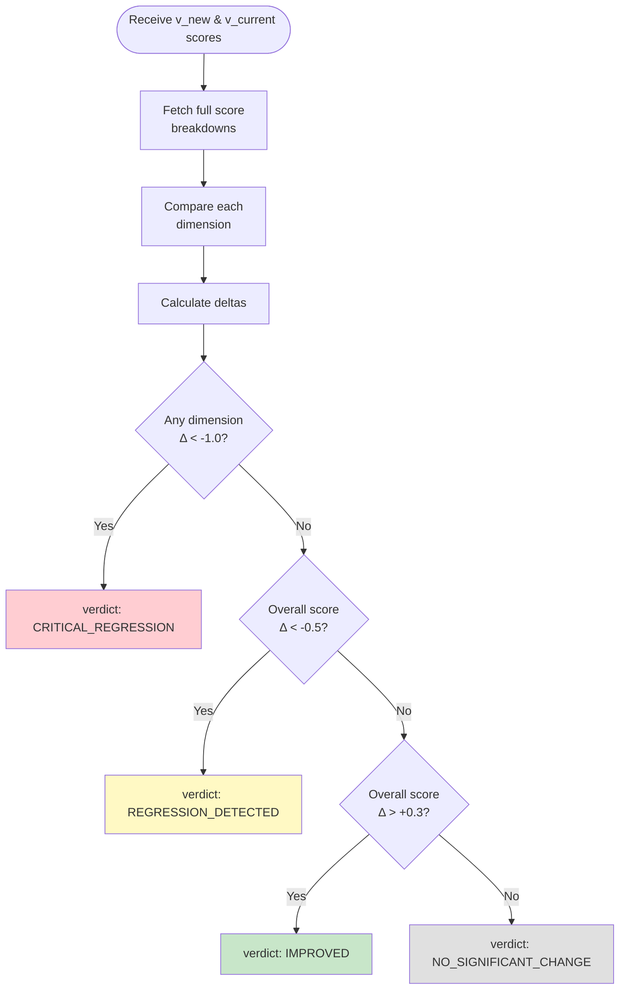

#### 2.2.6 Promotion Decision Agent — Action Matrix

| Comparator Verdict      | Decision     | Action                              | Notification   |
| ----------------------- | ------------ | ----------------------------------- | -------------- |
| `IMPROVED`              | AUTO_PROMOTE | Deploy `v_new` to production        | Log success    |
| `NO_SIGNIFICANT_CHANGE` | NO_ACTION    | Keep `v_current`                    | None           |
| `REGRESSION_DETECTED`   | ESCALATE     | Keep `v_current`, flag `v_new`      | Alert to human |
| `CRITICAL_REGRESSION`   | ROLLBACK     | Rollback to last known good version | Urgent alert   |

---

### 2.3 MCP Tool Layer

**Vai trò:** Abstraction layer chuẩn hóa giao tiếp giữa agents và infrastructure, sử dụng Model Context Protocol.

#### 2.3.1 Tại sao MCP, không phải REST?

| Aspect         | REST API                                    | MCP Server                                  |
| -------------- | ------------------------------------------- | ------------------------------------------- |
| Tool Discovery | Phải biết endpoints trước                   | Agent discover tools dynamically            |
| Schema         | OpenAPI/Swagger (agent không hiểu natively) | JSON Schema built-in, LLM-friendly          |
| Invocation     | Hardcoded HTTP calls                        | Agent tự chọn tool phù hợp dựa trên context |
| Extensibility  | Thêm endpoint = sửa code gọi API            | Thêm tool = agent tự biết dùng              |

#### 2.3.2 MCP Transport: Streamable HTTP

**Quyết định:** Dùng **streamable-http** transport cho tất cả MCP servers.

| Transport              | Cách hoạt động                                                         | Khi nào dùng                                          |
| ---------------------- | ---------------------------------------------------------------------- | ----------------------------------------------------- |
| **stdio**              | Agent spawn server như subprocess, giao tiếp qua stdin/stdout          | Đơn giản, tất cả cùng máy                             |
| **streamable-http** ✅ | Server chạy HTTP endpoint `/mcp`, client khởi tạo session rồi gọi tool | Phù hợp với FastMCP hiện tại và dashboard/API clients |

**Lý do chọn streamable-http:**

- Khớp với FastMCP server implementation hiện tại trong repo
- Cho phép tách deployment sau này (mỗi server thành service riêng) mà không cần đổi transport
- Dễ monitor (HTTP requests = dễ log, dễ debug) so với stdio (stdin/stdout khó trace)
- Dashboard và Python agents đều dùng chung flow `initialize` -> `mcp-session-id` -> `notifications/initialized` -> `tools/call`

#### 2.3.3 MCP Architecture Pattern

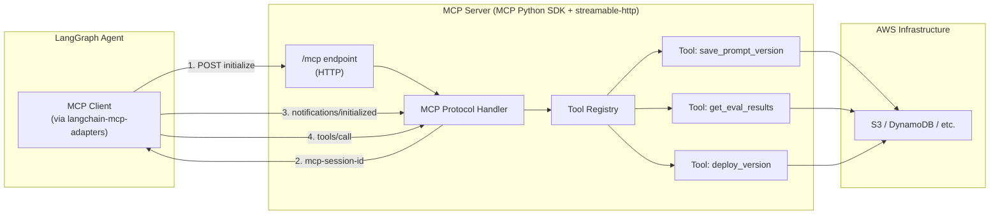

#### 2.3.4 MCP Server: Storage — Tool Specifications

| Tool Name             | Input                                                             | Output                                                     | AWS Resource  |
| --------------------- | ----------------------------------------------------------------- | ---------------------------------------------------------- | ------------- |
| `save_prompt_version` | `prompt_content: str`, `version_label: str`, `metadata: dict`     | `version_id: str`, `s3_path: str`, `timestamp: str`        | S3 + DynamoDB |
| `get_prompt_version`  | `version_id: str`                                                 | `prompt_content: str`, `metadata: dict`, `created_at: str` | S3 + DynamoDB |
| `list_versions`       | `limit: int = 20`, `status_filter: str = "all"`                   | `versions: list[VersionRecord]`                            | DynamoDB      |
| `save_eval_result`    | `run_id: str`, `version_id: str`, `scores: dict`, `details: list` | `result_id: str`, `timestamp: str`                         | DynamoDB      |
| `get_eval_results`    | `version_id: str` hoặc `run_id: str`                              | `results: list[EvalResult]`                                | DynamoDB      |

#### 2.3.5 MCP Server: Monitor — Tool Specifications

| Tool Name      | Input                                                      | Output                                                   | AWS Resource    |
| -------------- | ---------------------------------------------------------- | -------------------------------------------------------- | --------------- |
| `push_metric`  | `metric_name: str`, `value: float`, `dimensions: dict`     | `status: str`, `timestamp: str`                          | CloudWatch      |
| `get_metrics`  | `metric_name: str`, `version_id: str`, `time_range: str`   | `datapoints: list[{timestamp, value}]`                   | CloudWatch      |
| `get_logs`     | `log_group: str`, `filter_pattern: str`, `time_range: str` | `entries: list[LogEntry]`                                | CloudWatch Logs |
| `check_health` | `endpoint_url: str`                                        | `status: str`, `response_time_ms: int`, `timestamp: str` | HTTP Call       |

#### 2.3.6 MCP Server: Deploy — Tool Specifications

> **Staging vs Production Model:**
>
> - **Staging** = target app chạy port **9001**, nhận config mới để eval (chưa serve traffic thật)
> - **Production** = target app chạy port **9000**, config đang active, serve traffic thật
> - Deploy flow: deploy to staging → eval → nếu pass → swap staging config sang production

| Tool Name               | Input                                                             | Output                                                   | AWS Resource                           |
| ----------------------- | ----------------------------------------------------------------- | -------------------------------------------------------- | -------------------------------------- |
| `deploy_version`        | `version_id: str`, `environment: str` (`staging` \| `production`) | `deployment_id: str`, `status: str`, `endpoint_url: str` | EC2 (restart app on port 9000 or 9001) |
| `rollback_version`      | `target_version_id: str`                                          | `deployment_id: str`, `status: str`                      | EC2 (restart production app)           |
| `get_deployment_status` | `deployment_id: str` hoặc `environment: str`                      | `current_version_id: str`, `status: str`, `uptime: str`  | EC2                                    |

#### 2.3.7 Deployment Flow (MCP Deploy)

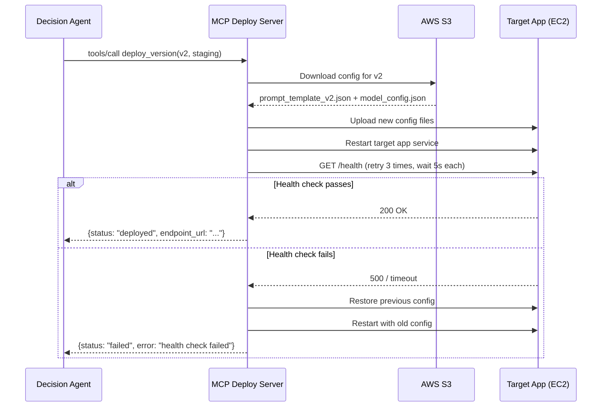

---

### 2.4 Data Layer

#### 2.4.1 DynamoDB Table: `agentops-versions`

| Attribute       | Type   | Key            | Description                                         |
| --------------- | ------ | -------------- | --------------------------------------------------- |
| `version_id`    | String | Partition Key  | UUID v4                                             |
| `version_label` | String | —              | Human-readable label (e.g., "v1.2-improved-prompt") |
| `s3_path`       | String | —              | Path to config files in S3                          |
| `prompt_hash`   | String | GSI            | SHA256 hash of prompt content (detect duplicates)   |
| `model_name`    | String | —              | e.g., "gemini-flash-2.0"                            |
| `temperature`   | Number | —              | e.g., 0.7                                           |
| `status`        | String | —              | `active` / `promoted` / `rolled_back` / `archived`  |
| `created_at`    | String | Sort Key (GSI) | ISO 8601 timestamp                                  |
| `created_by`    | String | —              | Git author                                          |
| `commit_sha`    | String | —              | Linked git commit                                   |

#### 2.4.2 DynamoDB Table: `agentops-eval-runs`

| Attribute            | Type   | Key           | Description                                            |
| -------------------- | ------ | ------------- | ------------------------------------------------------ |
| `run_id`             | String | Partition Key | UUID v4                                                |
| `version_id`         | String | GSI           | Version being evaluated                                |
| `trigger_id`         | String | —             | Linked trigger event                                   |
| `quality_score`      | Number | —             | Computed Quality Score (0-10)                          |
| `score_breakdown`    | Map    | —             | Per-dimension scores + weights                         |
| `test_suite_id`      | String | —             | Which test suite was used                              |
| `total_test_cases`   | Number | —             | Total test cases run                                   |
| `passed_test_cases`  | Number | —             | Test cases above threshold                             |
| `avg_latency_ms`     | Number | —             | Average response time                                  |
| `total_cost_usd`     | Number | —             | Total LLM API cost                                     |
| `status`             | String | —             | `completed` / `failed` / `partial`                     |
| `started_at`         | String | Sort Key      | ISO 8601                                               |
| `completed_at`       | String | —             | ISO 8601                                               |
| `decision`           | String | —             | `promoted` / `rolled_back` / `escalated` / `no_action` |
| `decision_reasoning` | String | —             | Agent's reasoning for the decision                     |

#### 2.4.3 S3 Bucket Structure

```
agentops-storage/
├── versions/
│   ├── v1/
│   │   ├── prompt_template.json
│   │   ├── model_config.json
│   │   └── metadata.json
│   ├── v2/
│   │   ├── prompt_template.json
│   │   ├── model_config.json
│   │   └── metadata.json
│   └── ...
├── eval-datasets/
│   ├── baseline_v1.json
│   ├── validation_suite_v1.json
│   └── ...
├── eval-results/
│   ├── run-{run_id}/
│   │   ├── raw_results.json
│   │   ├── quality_score.json
│   │   └── comparison_report.json
│   └── ...
└── deployments/
    └── current/
        ├── staging.json      # {version_id, deployed_at}
        └── production.json
```

#### 2.4.4 Config File Formats

**Prompt Template (`prompt_template.json`):**

```json
{
  "system_prompt": "You are a professional translator...",
  "user_prompt_template": "Translate the following text from {source_lang} to {target_lang}:\n\n{text}",
  "few_shot_examples": [{ "input": "...", "output": "..." }]
}
```

**Model Config (`model_config.json`):**

```json
{
  "model_name": "gemini-2.0-flash",
  "temperature": 0.3,
  "max_tokens": 2048,
  "top_p": 0.95
}
```

**Threshold Config (`configs/thresholds.json`):**

```json
{
  "overall_regression_threshold": -0.5,
  "critical_dimension_threshold": -1.0,
  "auto_promote_threshold": 0.3,
  "per_dimension_weights": {
    "task_completion": 0.35,
    "output_quality": 0.35,
    "latency": 0.2,
    "cost_efficiency": 0.1
  },
  "test_case_pass_threshold": 6.0,
  "health_check_retries": 3,
  "health_check_interval_seconds": 5
}
```

---

### 2.5 Presentation Layer (Dashboard)

#### 2.5.1 Dashboard Architecture

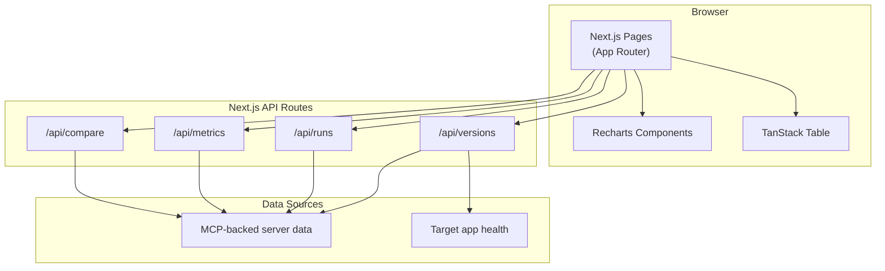

#### 2.5.2 Dashboard Pages

| Page            | Route                         | Data Source                                        | Key Visualizations                                           |
| --------------- | ----------------------------- | -------------------------------------------------- | ------------------------------------------------------------ |
| Overview        | `/`                           | MCP Storage + Monitor + Deploy + target app health | Current version badge, Quality Score gauge, recent runs list |
| Version History | `/versions`                   | MCP Storage                                        | Timeline/table of all versions with scores, status pills     |
| Metric Drift    | `/drift`                      | MCP Storage                                        | Multi-line chart: Quality Score over time per dimension      |
| Pipeline Runs   | `/runs`                       | MCP Storage + Monitor logs                         | Sortable table: all eval runs, expandable details            |
| Compare         | `/compare?left=...&right=...` | MCP Storage                                        | Side-by-side scores, outputs on matching test cases          |

---

## 3. End-to-End Data Flow

### 3.1 Happy Path: Developer Push → Auto Promote

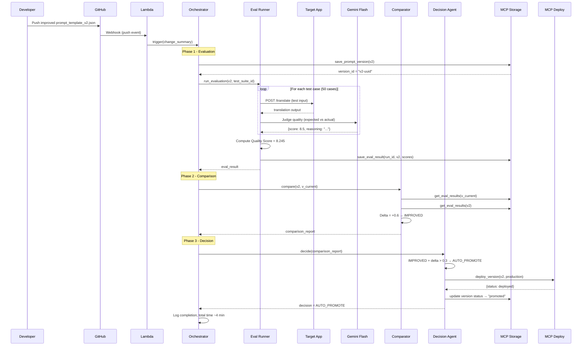

### 3.2 Failure Path: Regression Detected → Rollback

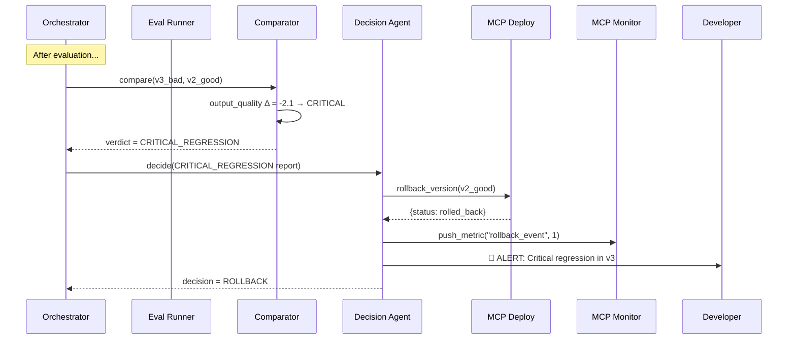

---

## 4. Infrastructure Layout

### 4.1 EC2 Instance Layout

```
EC2 t3.small (Ubuntu 22.04, 2GB RAM, Elastic IP attached)
├── /opt/agentops/
│   ├── target-app/            # Translation agent (FastAPI)
│   │   ├── venv/              # Isolated Python venv
│   │   └── ...                # port 9000 (prod) + port 9001 (staging)
│   ├── mcp-storage/           # MCP Server (SSE, port 8000)
│   │   ├── venv/              # Isolated Python venv
│   │   └── ...
│   ├── mcp-monitor/           # MCP Server (SSE, port 8001)
│   │   ├── venv/              # Isolated Python venv
│   │   └── ...
│   ├── mcp-deploy/            # MCP Server (SSE, port 8002)
│   │   ├── venv/              # Isolated Python venv
│   │   └── ...
│   ├── orchestrator/          # LangGraph agents (port 7000)
│   │   ├── venv/              # Isolated Python venv
│   │   └── ...
│   └── dashboard/             # Next.js (port 3000)
├── /etc/nginx/
│   └── sites-enabled/agentops  # Reverse proxy config
└── /var/log/agentops/          # Application logs
```

### 4.2 Nginx Reverse Proxy Config

```
server {
    listen 80;
    server_name agentops.example.com;

    # Dashboard
    location / {
        proxy_pass http://localhost:3000;
    }

    # MCP Servers (internal only — block from external)
    location /mcp/ {
        deny all;  # Only accessible from localhost
    }

    # Orchestrator trigger endpoint
    location /pipeline/ {
        proxy_pass http://localhost:7000;
        # Restrict to Lambda IP range (optional)
    }

    # Target app (if needed externally)
    location /api/translate/ {
        proxy_pass http://localhost:9000;
    }
}
```

### 4.3 Process Management

Dùng **systemd** để quản lý tất cả services:

| Service Name              | Command                                                                          | Port | Auto-restart |
| ------------------------- | -------------------------------------------------------------------------------- | ---- | ------------ |
| `agentops-target-prod`    | `/opt/agentops/target-app/venv/bin/python -m uvicorn target_app:app --port 9000` | 9000 | Yes          |
| `agentops-target-staging` | `/opt/agentops/target-app/venv/bin/python -m uvicorn target_app:app --port 9001` | 9001 | Yes          |
| `agentops-mcp-storage`    | `/opt/agentops/mcp-storage/venv/bin/python -m mcp_storage.server`                | 8000 | Yes          |
| `agentops-mcp-monitor`    | `/opt/agentops/mcp-monitor/venv/bin/python -m mcp_monitor.server`                | 8001 | Yes          |
| `agentops-mcp-deploy`     | `/opt/agentops/mcp-deploy/venv/bin/python -m mcp_deploy.server`                  | 8002 | Yes          |
| `agentops-orchestrator`   | `/opt/agentops/orchestrator/venv/bin/python -m orchestrator.server`              | 7000 | Yes          |
| `agentops-dashboard`      | `npm start` (trong dashboard/)                                                   | 3000 | Yes          |

---

## 5. Security Considerations

| Concern                           | Mitigation                                                            |
| --------------------------------- | --------------------------------------------------------------------- |
| AWS credentials trên EC2          | Dùng IAM Instance Role, không lưu credentials trong code              |
| Gemini API key                    | Lưu trong environment variable, không commit vào repo                 |
| GitHub webhook security           | Validate webhook signature (secret token) trong Lambda                |
| MCP servers không expose ra ngoài | Nginx block external access đến ports 8000-8002                       |
| Dashboard access                  | Basic auth hoặc restrict by IP (cho thesis scope, không cần phức tạp) |

---

## 6. Error Handling Strategy

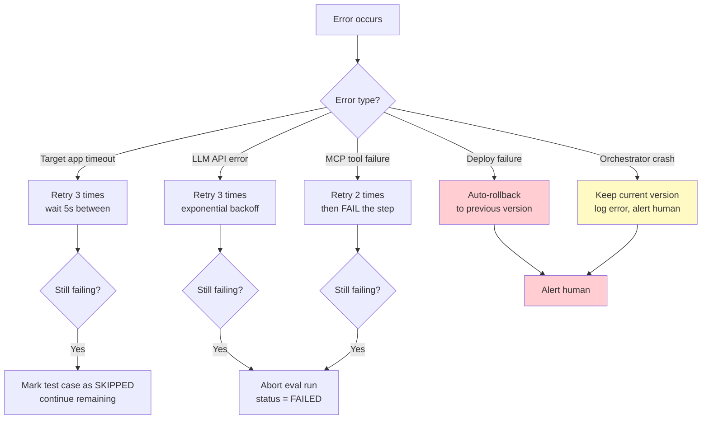

**Core principle:** Khi bất kỳ lỗi nào xảy ra mà không recover được → **giữ nguyên version hiện tại**, log error chi tiết, alert human. Không bao giờ deploy version mới khi pipeline không hoàn tất thành công.

---

## 7. Monitoring & Observability

| What                     | Tool                | Detail                                                               |
| ------------------------ | ------------------- | -------------------------------------------------------------------- |
| Agent execution traces   | LangSmith           | Mọi LangGraph call đều trace, xem được input/output/latency mỗi node |
| Infrastructure metrics   | CloudWatch          | CPU, memory, request count, error rate                               |
| Custom business metrics  | CloudWatch (custom) | Quality Score per version, eval run duration, regression count       |
| Application logs         | CloudWatch Logs     | Structured JSON logs từ tất cả services                              |
| Decision audit trail     | DynamoDB            | Mỗi decision lưu reasoning, scores, action taken                     |
| Dashboard visualizations | Next.js + Recharts  | Quality drift charts, version timeline, run history                  |

### CloudWatch Custom Metrics

| Metric Name          | Unit        | Dimensions                  | Description                         |
| -------------------- | ----------- | --------------------------- | ----------------------------------- |
| `QualityScore`       | None (0-10) | `version_id`, `environment` | Quality Score per evaluated version |
| `EvalRunDuration`    | Seconds     | `run_id`                    | Total time for one eval run         |
| `RegressionDetected` | Count       | `version_id`                | 1 when regression detected          |
| `AutoPromoteCount`   | Count       | —                           | Cumulative auto-promotes            |
| `RollbackCount`      | Count       | —                           | Cumulative rollbacks                |
| `EscalateCount`      | Count       | —                           | Cumulative escalations              |

---

## 8. Scalability Notes (Cho Tương Lai)

Thiết kế hiện tại nhắm tới scope thesis (single EC2 instance). Tuy nhiên, kiến trúc đã sẵn sàng scale:

| Bottleneck hiện tại            | Scale path                                            |
| ------------------------------ | ----------------------------------------------------- |
| Single EC2 cho tất cả services | Tách mỗi service thành container riêng (ECS/EKS)      |
| Sequential test case execution | Parallel execution với async / worker pool            |
| Single target app              | Hỗ trợ multi-app bằng cách parameterize app endpoint  |
| DynamoDB single table          | Đã dùng partition key + GSI → scale tự nhiên          |
| MCP servers trên cùng host     | Deploy thành separate services, agent connect qua SSE |

> **Quan trọng:** Trong scope thesis, không cần implement scale. Nhưng cần **document** rằng architecture cho phép scale, và chỉ ra cụ thể cách nào — đây là điểm cộng khi bảo vệ.
